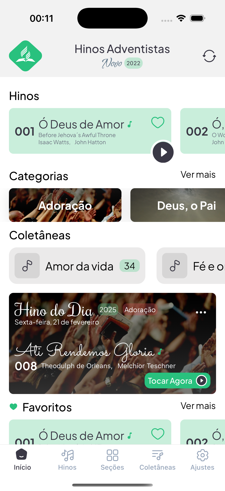
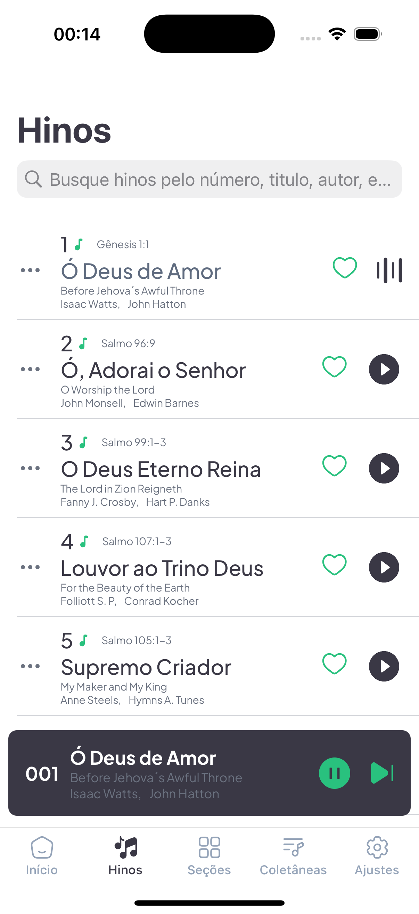
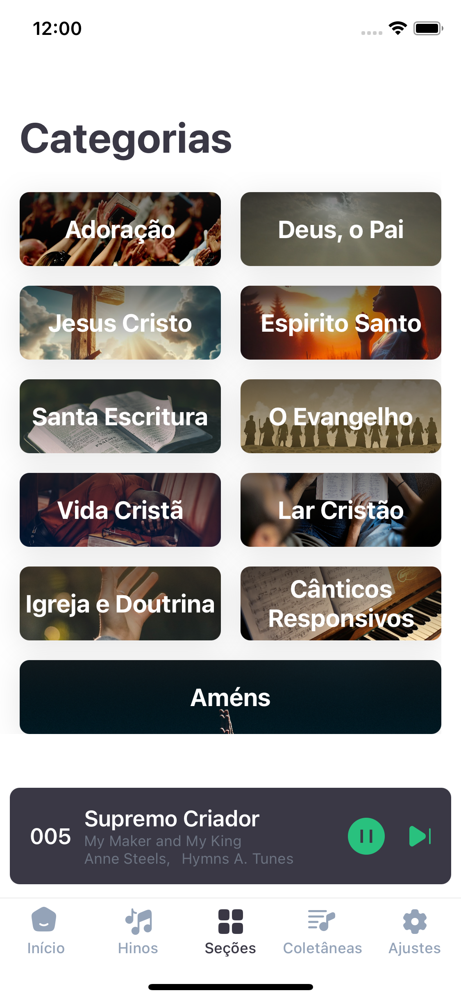
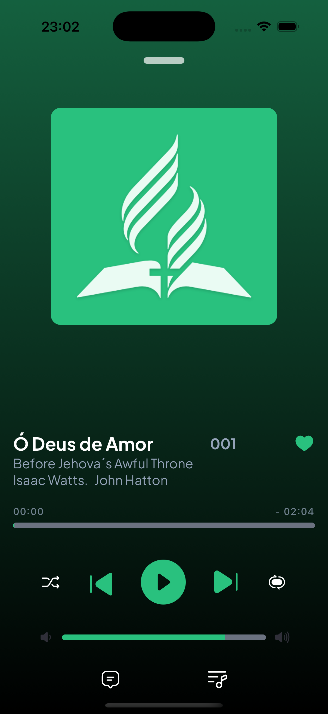

# HiASD App - iOS (UNDER DEVELOPMENT)

<div align="center">


[](https://choosealicense.com/licenses/mit/)
[](https://reactnative.dev/)
[](https://expo.dev/)
[](https://www.typescriptlang.org/)
[](https://www.apple.com/ios/)

</div>

## 📱 About

HiASD is a modern iOS application developed to facilitate access and management of Seventh-day Adventist Church hymns. With an intuitive interface and advanced features optimized for Apple devices, the app allows users to:

- Access the complete hymnal
- Create and manage custom playlists
- Download hymns for offline use
- Search hymns by number, title, or lyrics
- Share hymns and playlists

## 📱 Screenshots

<div align="center">
  <table>
    <tr>
      <td align="center">
        
        <br />
        <sub><b>Home Screen</b></sub>
      </td>
      <td align="center">
        
        <br />
        <sub><b>Hymns List</b></sub>
      </td>
      <td align="center">
        
        <br />
        <sub><b>App Sections</b></sub>
      </td>
      <td align="center">
        
        <br />
        <sub><b>Player Screen</b></sub>
      </td>
    </tr>
  </table>
</div>

## ✨ Main Features

### 📖 Digital Hymnal

- [x] Complete access to the Adventist hymnal
- [x] View lyrics and sheet music
- [x] Hymn audio playback
- Night mode for comfortable reading
- Dynamic Island and iOS widgets support

### 🎵 Playlists

- Unlimited playlist creation
- Custom hymn organization
- Playlist sharing via AirDrop
- iCloud synchronization
- Siri Shortcuts integration

### ⬇️ Offline Mode

- Download hymns for offline use
- Local storage management
- Automatic synchronization when online
- Playlist and settings backup via iCloud

## 🛠️ Technologies Used

- **React Native** - Mobile development framework
- **TypeScript** - JavaScript superset with static typing
- **Expo** - Universal development platform
- **Zustand** - State management
- **React Navigation** - Screen navigation
- **AsyncStorage** - Local storage
- **i18n** - Internationalization
- **iOS SDK** - Native Apple platform features

## 📂 Project Structure

```
hiasdapp/
├── assets/
│   └── app/
├── src/
│   ├── app/
│   │   └── (tabs)/
│   │       ├── home/
│   │       ├── hymns/
│   │       ├── playlists/
│   │       └── settings/
│   ├── components/
│   │   ├── util/
│   │   └── svg/
│   ├── constants/
│   ├── hooks/
│   ├── styles/
│   ├── types/
```

## 🚀 Getting Started

### Prerequisites

- macOS (for iOS development)
- Node.js >= 18
- npm or yarn
- Expo CLI
- Xcode 14 or higher
- iOS Simulator or physical iOS device
- Apple Developer Account (for distribution)

### Installation

1. Clone the repository

```bash
git clone https://github.com/your-user/hiasdapp.git
```

2. Install dependencies

```bash
cd hiasdapp
yarn
cd ios
pod install
```

3. Test the project

```bash
cd hiasdapp
yarn test
```

4. Start the project

```bash
npx expo run:ios
```

## 🤝 Contributing

Contributions are always welcome! To contribute:

1. Fork the project
2. Create your Feature Branch (`git checkout -b feature/AmazingFeature`)
3. Commit your changes (`git commit -m 'Add some AmazingFeature'`)
4. Push to the Branch (`git push origin feature/AmazingFeature`)
5. Open a Pull Request

## 📝 License

This project is licensed under the MIT License. See the [LICENSE](LICENSE) file for details.

## 📧 Contact

- Email: mosmmy@gmail.com
- LinkedIn: [Moser José](https://linkedin.com/in/moser-jose)
- GitHub: [@moser-jose](https://github.com/moser-jose)

## 👥 Contributors

| [<br><sub>@moser-jose</sub>](https://github.com/moser-jose) | [<br><sub>@mkistre</sub>](https://github.com/mkistre) |
| :---------------------------------------------------------------------------------------------------------------------------------: | :-------------------------------------------------------------------------------------------------------------------------------: |

---

<div align="center">
Made with ❤️ by Moser José
</div>
